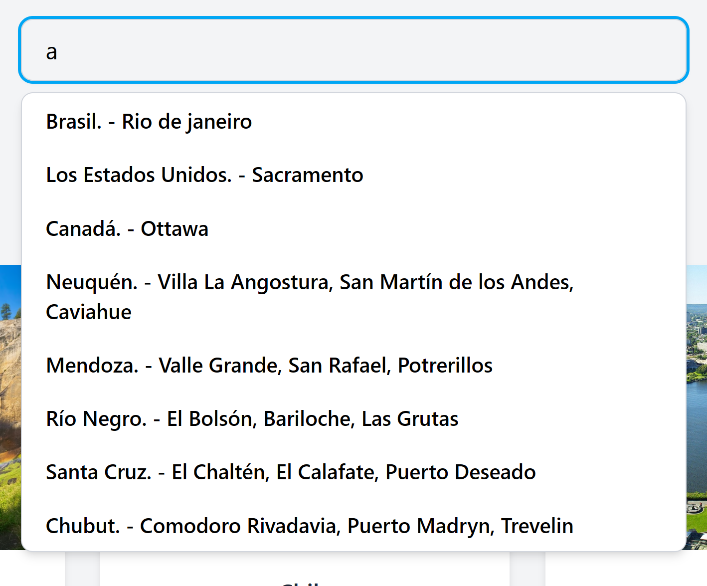

# 🌍 TourMundo

## ℹ️ Información del proyecto

**Nombre del proyecto: TourMundo**  
**Materia: Programacion Web Avanzada**  
**Profesor: Agustin Chiarotto**  
**TP nº 1 React - Parte 2** 
**Link Vercel:** https://tp2-react-mu.vercel.app/

## 👥 Integrantes del grupo

- Francisco Pandolfi FAI-4650
- Leandro Resler FAI-4275
- Martín Paredes FAI-4997

## 📌 Descripción de la aplicación

Este proyecto es una aplicación web desarrollada con React, diseñada para explorar y buscar tours internacionales de diversas partes del mundo, así como tours nacionales dentro de Argentina. La plataforma permite navegar entre distintas secciones como inicio, detalles y favoritos. En la sección de detalles, se ofrece información completa sobre cada tour, incluyendo país, provincia, descripciones, lugares destacados y atracciones turísticas. Los usuarios pueden agregar tours a una lista de favoritos, consultar sus detalles o eliminarlos de la lista según su preferencia.

## 🌐 Integración de API

Para la obtención de datos, esta aplicación utiliza MockAPI, una API simulada que permite gestionar información de manera temporal durante el desarrollo. Esto facilita el manejo de datos ficticios sin necesidad de configurar un servidor backend real.

### Funcionalidades principales:

- 🗺️ Visualizar tours internacionales y nacionales.
- 🔍 Buscar tours por país, provincia, ciudad y lugares destacados.
- ✅ Agregar o eliminar tours de una lista de favoritos.
- 📄 Mostrar detalles completos de cada tour.
- 🌐 Navegación entre páginas (Inicio, Detalles y Favoritos).
- 🌎 Selector de idiomas (Español e Inglés).
- 📥 Descargar un PDF con los detalles del tour.

---

## 🧪 Tecnologías utilizadas

- React
- JavaScript
- HTML / CSS
- Node.js
- Vite
- Tailwind CSS

---

## 🛠️ Instrucciones de instalación y ejecución

Siga estos pasos para clonar e instalar correctamente el proyecto en su entorno local. 
**1.Abrir una terminal** y ejecutar el siguiente comando para clonar el repositorio: git clone https://github.com/FranciscoPJ/Tp2-React.git 
**2.Ingresar al directorio del proyecto**: cd Tp2-React. 
**3.Instalar las dependencias** ya que es un proyecto con Node.js: npm install 
**4.Iniciar el servidor local**: npm run dev. 
**5.Abrir el navegador**: Copie la URL del servidor local que aparece en la consola, abre su navegador y péguela en la barra de direcciones.

---

## Instruccion de uso de la app

1-En la imagen muestra el inicio de la pagina de TourMundo.

2-La seccion header tiene el titulo de la empresa de tours, enlaces para navegar entre las paginas "inicio" o "favoritos" y el selector de cambio de idioma (Ingles o Español).

3-Un input para buscar un tour internacional o nacional, ingresando el pais, provincia, ciudad o lugares.

4-Resultados del buscador con la letra "a". Al hacer click en unos de los opciones, lo dirigira a la pagina "detalles" con la descripcion del tour.

5-Visualizacion de la lista tours intenacionales.

6-Visualizacion de la lista tours nacionales.

7-La seccion footer tiene una breve descripcion de TourMundo, coctacto con su ubicacion, celular y correro electronico, redes sociales, como facebook, instagram y x y los derechos estan todos resevados.

8-Pagina "dettales", muestra la informacion completa de un tour seleccionado. Ademas tiene la opcion de descargar la informacion en un archivo pdf y de agregarlo a la lista de favoritos.

9-Este tour fue agregado a la lista de favoritos y el boton cambio su texto por "Agregado", de color verde.

10-Al hacer click en "Descargar PDF", crea un archivo pdf, importando toda la descripcion y imagen del tour.

11-Pagina "favoritos", muestra un listado de todos los tours favoritos, donde se pueden eliminar del listado o volver a ver nuevamente su descripcion completa.

<!-- ## Información relevante -->
